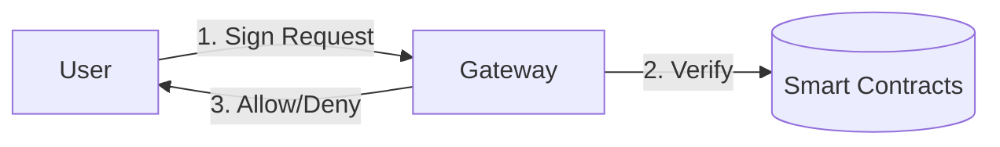

# AccessKey — Decentralized API Access & Subscription Protocol

  

> **⚠️ SECURITY DISCLAIMER:** AccessKey is an educational and portfolio-grade protocol designed using production-oriented engineering practices. It has **not** undergone a professional security audit and **must not** be used with real funds.

## Overview
AccessKey is a hybrid Web3 authorization and subscription protocol that uses Ethereum smart contracts for verifiable ownership, subscription state, payment settlement, and access control, while keeping high-frequency API traffic and usage metering off-chain.

### Why Blockchain?
Blockchain provides verifiable ownership, transparent payment settlement, and decentralized access control. Users don't need to trust the provider's billing system; the smart contracts enforce the agreed-upon price, duration, and protocol fee securely.

### Why Not Put API Calls On-Chain?
High-frequency API traffic would be extremely expensive and inefficient if put on-chain. AccessKey uses the blockchain as a root of trust for authorization, while processing the actual API traffic and real-time usage metering via an off-chain API Gateway.

## Architecture



### Core Features (V2 Architecture)

- **Trustless State-Channel Settlement:** Usage metering is completely trustless. API Gateways require EIP-712 cryptographic signatures directly from the user, preventing providers from forging usage.
- **Time-Locked Streaming Escrow:** Provider revenue is locked in a streaming escrow and unlocks linearly block-by-block, protecting users from rug-pulls and sudden service deprecation.
- **Prorated Upgrades & Instant Refunds:** Upgrades and cancellations dynamically calculate unearned stream balances and instantly refund the subscriber.
- **Fiat-Pegged Pricing Oracles:** Deep integration with Chainlink `AggregatorV3Interface` allows providers to price plans in USD while settling in dynamic ERC-20 amounts.
- **Delegated Auto-Renewals:** Support for Chainlink Automation / Keepers to pull pre-approved ERC-20 tokens and seamlessly renew expired subscriptions without manual intervention.
- **Deflationary Token Support:** Strict `balanceAfter - balanceBefore` accounting safely processes fee-on-transfer and deflationary tokens natively.
- **Secure Architecture:** CEI patterns used everywhere, pull-over-push withdrawals, strict access control.
- **Gas Optimized:** Utilizes `calldata`, custom errors, and efficient state packing.
- **EIP-712 Signatures:** Secure, replay-protected signed settlements for usage.

## Development

### Prerequisites
- [Foundry](https://getfoundry.sh/)
- Node.js (for Gateway)

### Testing
We use Foundry for comprehensive testing, including integration tests, fuzz tests, and gas snapshots.

```bash
forge install
forge test
forge snapshot
```

### API Gateway (Demo)
A minimal TypeScript reference implementation of the API Gateway is available in `gateway/`.

```bash
cd gateway
npm install
npx ts-node index.ts
```

## Documentation
See the `/docs` folder for detailed specifications:
- [Threat Model](docs/threat-model.md)
- [Architecture](docs/architecture.md)
- [EVM Guide](docs/evm.md)
- [ADRs](docs/decisions/)

## Deployment
*Local testing supported via `anvil`. Sepolia deployment scripts pending configuration.*

## Copyright & Attribution
Copyright (c) 2026 AccessKey Protocol.

This project is licensed under the MIT License. If you intend to use, modify, or distribute any part of this software, **you must include the original copyright notice and give appropriate attribution** by quoting the source. See the `LICENSE` file for more details.
